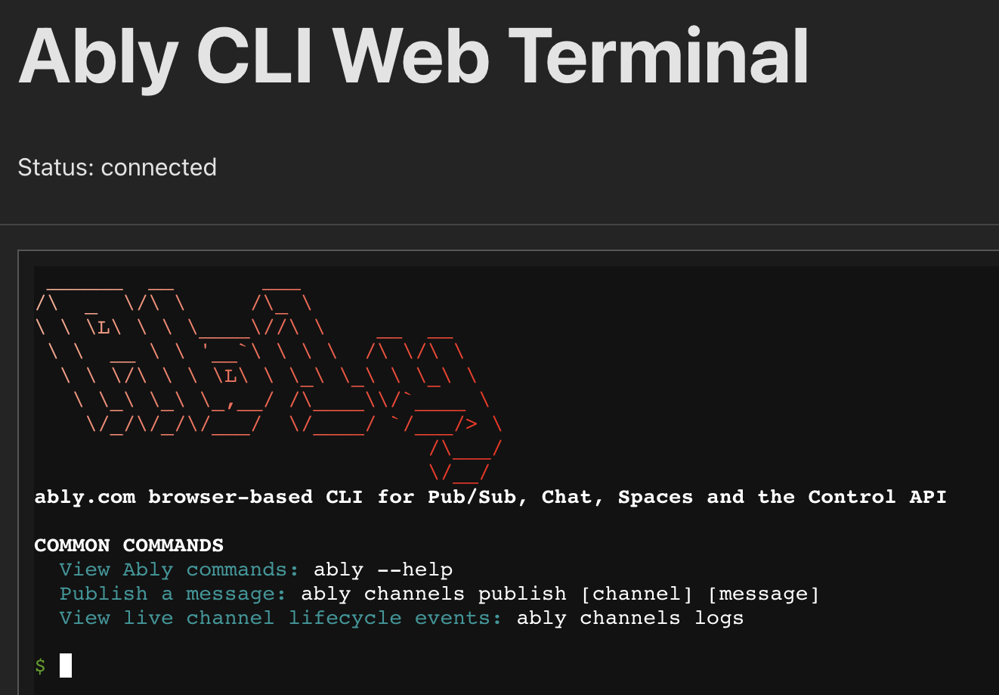

# @ably/react-web-cli


A React component for embedding an interactive Ably CLI terminal in web applications.



## Features

* Embed a **fully-featured Ably CLI** session (xterm.js) inside any React app.
* Secure WebSocket connection to the Ably terminal-server using an **API Key or Access Token**.
* First-class terminal UX: 
  * Terminal-native status messages with ANSI colors
  * Animated spinner while (re)connecting
  * Live countdown and clear guidance (press **Enter** to cancel / retry)
  * ASCII modal boxes for important status messages
* Robust connection handling:
  * Automatic exponential-back-off reconnects (0 s, 2 s, 4 s, 8 s …)
  * Configurable maximum reconnection attempts (default: 15) before switching to manual reconnect
  * Proper handling of server-initiated disconnections with specific error codes
* **Session resumption** on page reload or transient network loss (`resumeOnReload`).
* Works in fullscreen or in a resizable drawer (see `examples/web-cli`).
* Written in TypeScript & totally tree-shakable.

## Installation

```bash
# Using npm
npm install @ably/react-web-cli

# Using yarn
yarn add @ably/react-web-cli

# Using pnpm
pnpm add @ably/react-web-cli
```

## Prerequisites

- React 17.0.0 or higher
- A running instance of the Ably CLI terminal server (provided in the main CLI package)
- Valid Ably API Key and Access Token

## Usage

```tsx
import { useState } from "react";
import { AblyCliTerminal } from "@ably/react-web-cli";

export default function MyTerminal() {
  const [status, setStatus] = useState("disconnected");

  return (
    <div style={{ height: 500 }}>
      <AblyCliTerminal
        websocketUrl="ws://localhost:8080"
        /* provide either an API-key … */
        ablyApiKey="YOUR_ABLY_API_KEY"
        /* …or an Access-Token (JWT) */
        // ablyAccessToken="YOUR_ABLY_TOKEN"
        initialCommand="ably --version"
        onConnectionStatusChange={setStatus}
        onSessionEnd={(reason) => console.log("session ended", reason)}
        onSessionId={(id) => console.log("session id", id)}
        resumeOnReload
        maxReconnectAttempts={15}
      />

      <p>Status: {status}</p>
    </div>
  );
}
```

## Props

| Prop | Type | Required | Default | Description |
|------|------|----------|---------|-------------|
| `websocketUrl` | string | ✅ | - | URL of the WebSocket terminal server |
| `ablyApiKey` | string | ☑️ * | - | Ably API key for authentication |
| `ablyAccessToken` | string | ☑️ * | - | Ably access token for authentication |
| `initialCommand` | string | No | - | Command to run on startup |
| `onConnectionStatusChange` | function | No | - | Callback when connection status changes |
| `onSessionId` | function | No | - | Callback when session ID is received |
| `onSessionEnd` | function | No | - | Callback when session ends |
| `maxReconnectAttempts` | number | No | 15 | Maximum reconnection attempts before giving up |
| `resumeOnReload` | boolean | No | false | Whether to attempt to resume an existing session after page reload |

*\* Provide one credential – omit both if your terminal-server allows anonymous access.

## Connection States

The component manages several connection states that your application can respond to:

- `initial`: Terminal is initializing
- `connecting`: Attempting to connect to the server
- `connected`: Successfully connected and ready
- `disconnected`: Connection closed by server or manually by user
- `reconnecting`: Attempting to reconnect after a connection drop
- `error`: Connection error or other terminal error

## Server-Initiated Disconnections

The terminal properly handles server-initiated disconnections with specific WebSocket close codes:

| Code | Description | Behavior |
|------|-------------|----------|
| 1000 | Normal closure | Shows reason in terminal, requires manual reconnect |
| 1001 | Server going away | Shows service restart message, requires manual reconnect |
| 1011 | Server error | Shows unexpected condition message, requires manual reconnect |
| 1013 | Service unavailable | Shows service unavailable message, requires manual reconnect |
| 4000 | Generic server disconnect | Shows server-provided reason, requires manual reconnect |
| 4001 | Authentication failed | Shows authentication error with instructions, requires manual reconnect |
| 4008 | Policy violation | Shows auth timeout/format message, requires manual reconnect |
| 4429 | Capacity limit reached | Shows capacity message with CLI install instructions, requires manual reconnect |

For other WebSocket close codes, the terminal will automatically attempt to reconnect using an exponential backoff strategy.

## Session Resumption

When `resumeOnReload` is enabled, the terminal will store the session ID in `sessionStorage` and attempt to resume the session after a page reload. This allows for a seamless experience when navigating away and back to the page.

## Setting Up a Terminal Server

The terminal server required for this component is provided in the main Ably CLI package. To run it:

1. Ensure you have the Ably CLI Docker image built:

   ```bash
   # In the Ably CLI repository root
   docker build --no-cache -t ably-cli-sandbox .
   ```

2. Start the terminal server:

   ```bash
   # In the Ably CLI repository root
   pnpm terminal-server
   ```

3. The server will start on `ws://localhost:8080` by default.

## Notes

- The terminal requires a container for sizing, so make sure the parent element has a defined height and width.
- The component handles reconnection automatically with exponential backoff.
- Only `ably` and `exit` commands are available in the terminal by default.
- The terminal supports full xterm.js functionality including colors and Unicode.

## Example Project

For a complete example of using this component, see the [web-cli example](https://github.com/ably/cli/tree/main/examples/web-cli) in the Ably CLI repository.

## Development

```bash
# Install dependencies
pnpm install

# Build the package
pnpm build

# Run tests
pnpm test
```

## License

[Apache-2.0](https://github.com/ably/cli/blob/main/LICENSE)
